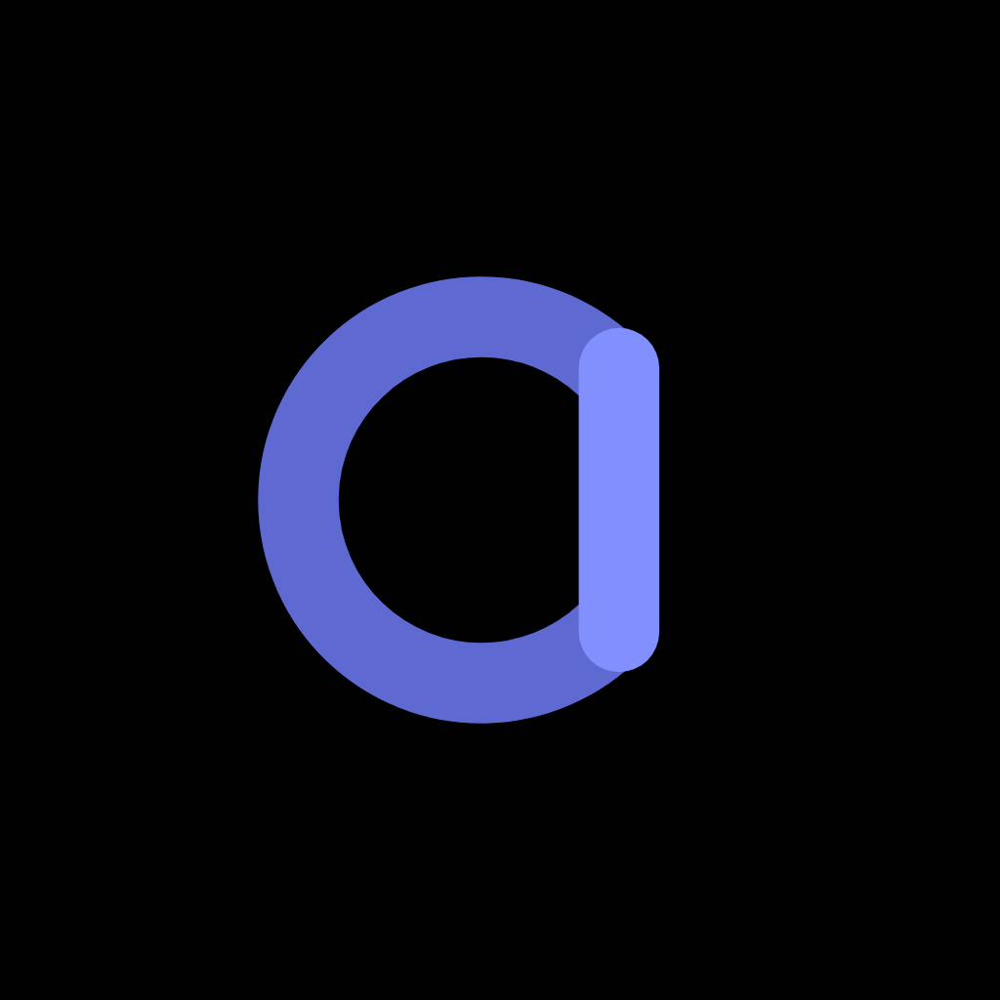

<div align="center">



# Cleat

**Security, maintenance, and audit for your GitHub account and organizations.**

Connect GitHub, and Cleat surfaces leaked secrets, vulnerable dependencies, risky Actions
workflows, and reclaimable spend, then alerts you the moment something critical happens.

<br />


<br />


</div>

---

## Overview

Cleat keeps an eye on the parts of GitHub that are easy to lose track of. It brings five areas
together into one dark, focused dashboard:

| Area | What it covers |
| --- | --- |
| **Security** | Leaked secrets, vulnerable dependencies ranked by real exploitability, and code-scanning alerts |
| **Supply chain** | Actions audit for unpinned actions, broad permissions, and missing OIDC, plus live incident bulletins |
| **Dependencies and SBOM** | Full inventory, license compliance, and exportable SBOMs |
| **Maintenance** | Reclaim storage spend from forgotten artifacts, stale caches, and untagged packages, with per-repo hygiene scores |
| **Governance** | Members and 2FA, OAuth and GitHub Apps, webhooks, keys, token hygiene, the audit log, and notifications |

## Project status

The frontend is built and working today. It runs on realistic, deterministic dummy data, so you
can click through the entire product without connecting anything. The Java and Spring Boot backend
that will replace the dummy data with live GitHub intelligence is designed but not yet built.

## Repository layout

This is a monorepo.

```
cleat/
  apps/
    web/        frontend SPA: React, TypeScript, Vite, Tailwind (live, dummy data)
  backend/      Java and Spring Boot (planned, placeholder for now)
  docs/         shared documentation
  AGENTS.md     contributor and AI-assistant guide
```

## Getting started

You need [Bun](https://bun.com) installed. The frontend lives in `apps/web`.

```bash
cd apps/web
bun install
bun run dev        # http://localhost:5173
```

Other commands, all run from `apps/web`:

```bash
bun run build      # production build
bun run typecheck  # strict TypeScript check
bun run preview    # serve the production build
```

## Tech stack

**Frontend (live):** React 19, TypeScript (strict), Vite, Tailwind CSS v4, Zustand, Recharts,
lucide-react, and Motion. The visual system is documented in `apps/web/DESIGN.md`.

**Backend (planned):** Java with Spring Boot, organized as a multi-module project covering the
API, a webhook receiver, scan orchestration, per-domain workers, enrichment, and a GitHub App
client. See [`backend/README.md`](backend/README.md) for the module layout.

## Contributing

We would love your help. Start with [CONTRIBUTING.md](CONTRIBUTING.md) for how to set up, branch,
and open a pull request. By taking part you agree to our [Code of Conduct](CODE_OF_CONDUCT.md).

## Security

Found a vulnerability? Please do not open a public issue. See [SECURITY.md](SECURITY.md) for how
to report it privately. Cleat is a security product, so we hold our own code to the bar we ask of
others.

## License

Cleat is proprietary software, all rights reserved. See [LICENSE](LICENSE).
